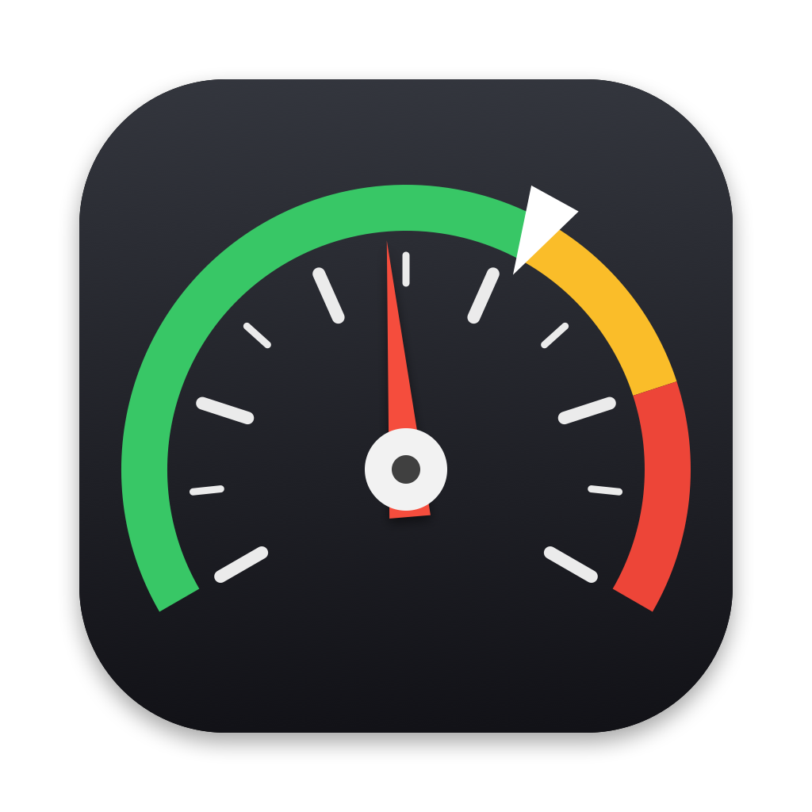
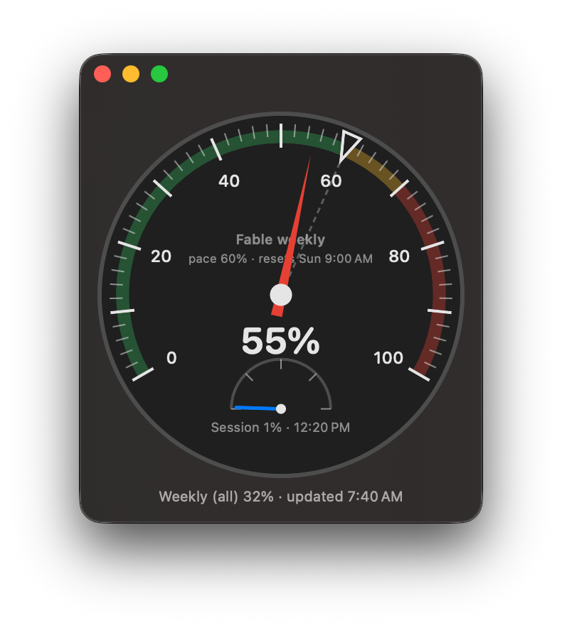

<p align="center"></p>

# TokenMeter

A small native macOS app that shows your Claude Code usage as an analog speedometer, so you can tell at a glance whether you're ahead of or behind pace for the week.

<p align="center"></p>

## What it shows

| Element | Meaning |
|---|---|
| **Red needle** and big number | Actual Fable weekly usage, from Anthropic |
| **Triangle marker** and dashed line | Where you *should* be based on the work week |
| **Colored arc** | Green up to pace, amber up to 10 points over, red beyond that |
| **Small lower dial** | Current 5-hour session usage and when it resets |
| **Status line** | All-models weekly usage and the time of the last update |

### Expected pace

Only work hours count: Monday–Friday, 8:00 AM–5:00 PM local time, 45 hours in all.

- Monday 8:00 AM → 0%
- Wednesday 12:30 PM → 50%
- Friday 5:00 PM → 100%

Pace doesn't move overnight, and it holds at 100% over the weekend. To change the hours or days, edit `workdayStartHour`, `workdayEndHour` and `workdays` in `Sources/TokenMeter/PaceCalculator.swift`.

> Anthropic's actual weekly limit resets on its own schedule (shown on the dial as "resets …"), which may not line up with the Monday–Friday pace.

## Where the data comes from

TokenMeter reuses the login that Claude Code already stores:

1. It reads Claude Code's OAuth token from the macOS Keychain (item `Claude Code-credentials`) using `/usr/bin/security`.
2. It calls `GET https://api.anthropic.com/api/oauth/usage`, the same endpoint behind `/usage` in Claude Code.
3. It polls every 2 minutes. Press **⌘R** or double-click the window to refresh now.

The token is only sent to `api.anthropic.com`. TokenMeter **never refreshes the token itself**, because that would rotate Claude Code's refresh token and could break Claude Code's login. If the token expires, the window says *"Token expired — run `claude` to refresh"*. Run any Claude Code command and the meter recovers on its next poll.

This endpoint isn't a documented public API and may change. Missing values show as `--` and don't crash the app.

## Requirements

- macOS 15 or later
- Claude Code installed and logged in with a Claude subscription
- To build: Xcode or the Swift 6 toolchain

## Install

Download **TokenMeter.dmg** from the [latest release](../../releases/latest) or directly from [`dist/TokenMeter.dmg`](dist/TokenMeter.dmg?raw=1), open it, and drag **TokenMeter** into **Applications**.

The app is signed with a Developer ID and notarized by Apple, so it opens without Gatekeeper warnings. It's a universal build (Apple silicon and Intel).

## Build from source

```sh
swift test                 # run the unit tests
swift run                  # run in development
./scripts/build-app.sh     # → build/TokenMeter.app
./scripts/make-dmg.sh      # → build/TokenMeter.dmg (ad-hoc signed)
./scripts/notarize.sh      # → signed, notarized, stapled DMG, copied to dist/
swift scripts/make-icon.swift   # regenerate Resources/AppIcon.icns
```

`notarize.sh` needs a Developer ID Application certificate and a saved `notarytool` profile. Set `SIGN_IDENTITY` and `NOTARY_PROFILE` to use your own.

`open Package.swift` opens the project in Xcode.

## Project layout

```
Sources/TokenMeter/
  TokenMeterApp.swift    floating window, ⌘R command
  ContentView.swift      gauge and status line
  GaugeView.swift        Canvas-drawn speedometer
  UsageService.swift     Keychain read, polling, error state
  UsageModels.swift      lenient decoding of the usage response
  PaceCalculator.swift   work-hours pace math
Tests/TokenMeterTests/   pace and decoding tests
Resources/                Info.plist, AppIcon.icns
dist/                    notarized TokenMeter.dmg
scripts/                 icon, .app, .dmg and notarization scripts
```
